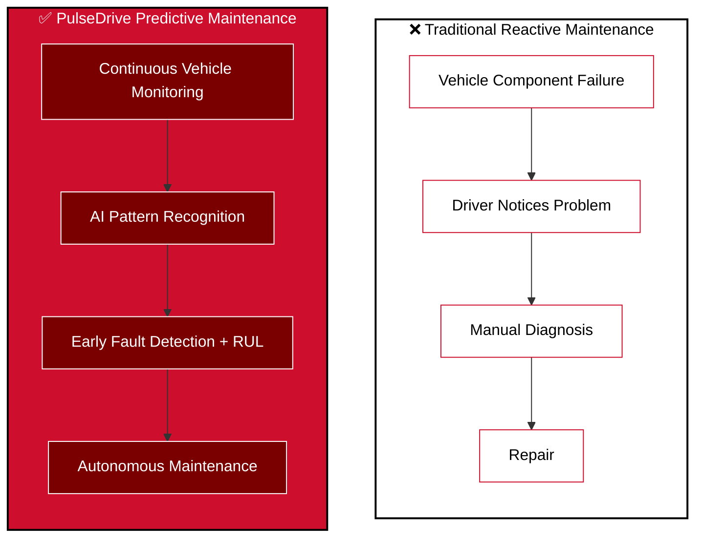
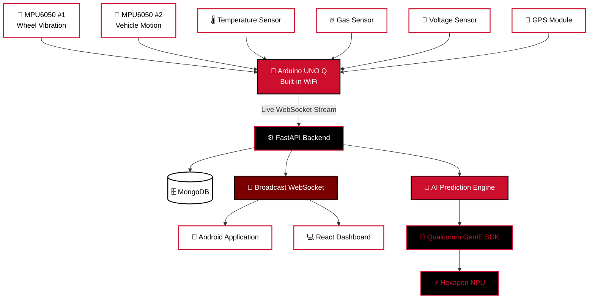
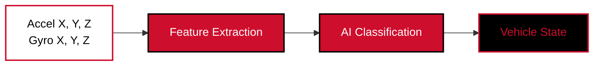
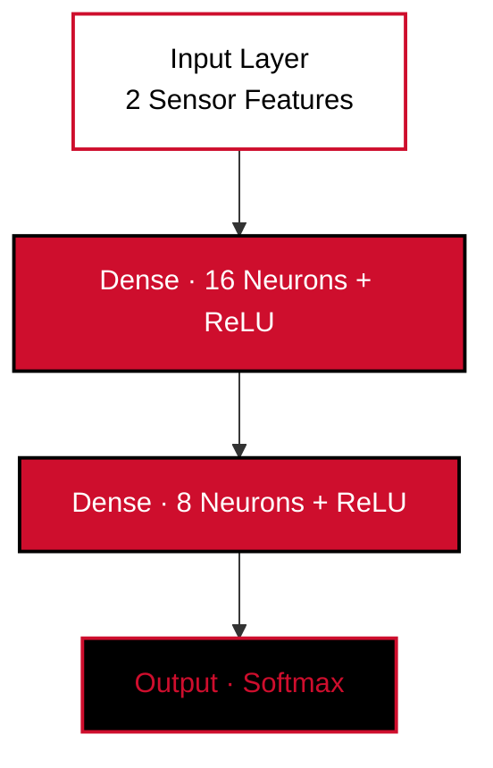
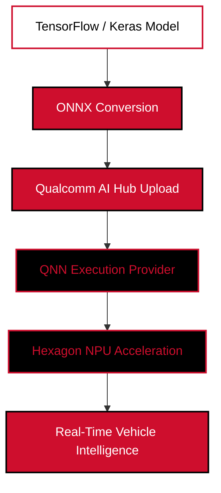
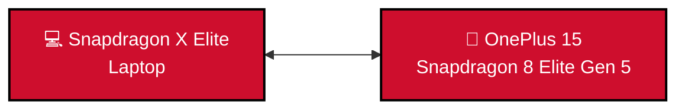
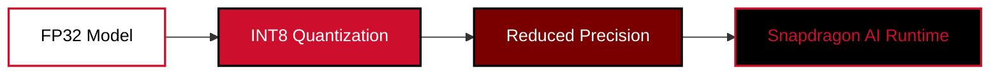
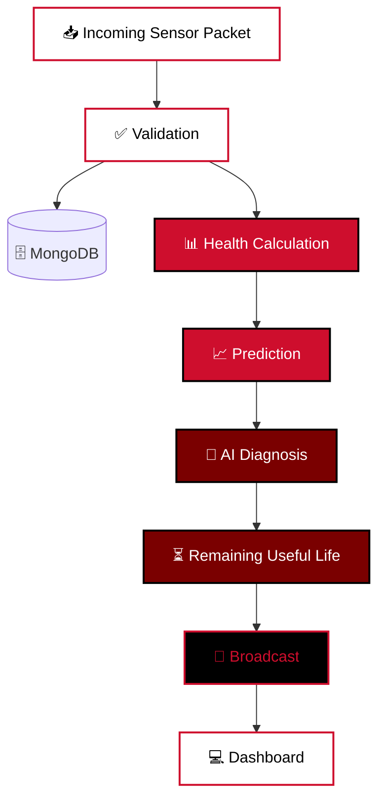
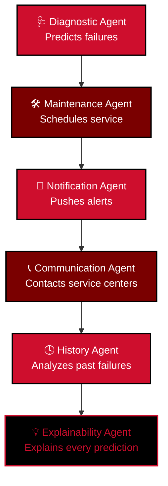

<div align="center">


### Built for the Qualcomm Snapdragon Hackathon 2026


<br>


<br>


</div>

<br>

> PulseDrive is an end-to-end AI-driven predictive maintenance platform that continuously monitors vehicle health using multiple IoT sensors, Edge AI, Agentic AI orchestration, and Qualcomm AI acceleration. Unlike traditional diagnostic systems that only detect faults **after** they occur, PulseDrive continuously analyzes real-time sensor telemetry to **predict failures before they happen**, estimate **Remaining Useful Life (RUL)**, generate **AI-powered recommendations**, and **automatically schedule maintenance** — all designed to run locally on Qualcomm Snapdragon AI hardware.

<div align="center">

</div>

## 📑 Table of Contents

<table>
<tr valign="top">
<td width="33%">

**Foundation**
- [Overview](#overview)
- [Objectives](#objectives)
- [Problem Statement](#problem-statement)
- [Our Solution](#our-solution)
- [System Architecture](#system-architecture)
- [Hardware Implementation](#hardware-implementation)
- [Sensor Schema & Telemetry](#data-pipeline)

</td>
<td width="33%">

**Intelligence Layer**
- [Machine Learning Models](#ml-models)
- [Qualcomm Edge AI Pipeline](#edge-ai-pipeline)
- [Qualcomm GenIE](#genie)
- [INT8 Quantization](#quantization)
- [AI Assistant](#ai-assistant)
- [Agentic AI](#agentic-ai)
- [Edge AI Features](#edge-ai-advantages)

</td>
<td width="33%">

**Application Layer**
- [Software Architecture](#software-architecture)
- [Vehicle Health Dashboard](#dashboard)
- [Live Demo Scenarios](#demo-scenarios)
- [Android Application](#android-app)
- [Security & APIs](#security-apis)
- [Future Scope](#future-scope)
- [Why PulseDrive Stands Out](#stands-out)
- [Gallery & Demo Video](#gallery)
- [Team](#team)

</td>
</tr>
</table>

<div align="center">

</div>

<a id="overview"></a>
## 🚘 Overview

Modern vehicles usually detect failures **after the problem has already occurred**.

> A component fails → the driver notices abnormal behavior → a repair is performed.

<div align="center">

| ❌ Reactive | ❌ Expensive | ❌ Time Consuming | ❌ Manual | ❌ Opaque |
|:---:|:---:|:---:|:---:|:---:|

</div>

**PulseDrive flips this model.** It continuously observes vehicle conditions, detects abnormal patterns, predicts possible failures before breakdown, explains *why* using AI, estimates how much life a component has left, and can autonomously schedule maintenance — powered end-to-end by:

- 📡 Multi-sensor IoT monitoring
- 🧠 Machine Learning fault detection
- ⏱️ Real-time WebSocket telemetry
- ⚡ Edge AI inference
- 🤖 Agentic AI orchestration
- 🚀 Qualcomm Snapdragon NPU acceleration + GenIE SDK
- ☁️ Cloud-connected web dashboard
- 📱 Android vehicle companion application


---

<a id="objectives"></a>
## 🎯 Objectives

<table>
<tr><td>

✅ Monitor live vehicle telemetry
✅ Predict failures before breakdown
✅ Estimate Remaining Useful Life (RUL)
✅ Detect hazardous conditions

</td><td>

✅ Explain AI decisions
✅ Automatically recommend maintenance
✅ Schedule service automatically
✅ Notify users in real time

</td><td>

✅ Run AI locally on Qualcomm Snapdragon
✅ Operate fully offline via Edge AI
✅ Deliver millisecond-latency updates

</td></tr>
</table>

---

<a id="problem-statement"></a>
## 🚧 Problem Statement

Vehicle failures usually occur without sufficient warning because existing monitoring systems rely on **reactive diagnostics**. Current systems generally:

- Detect faults only **after** damage occurs
- Require manual inspection
- Cannot explain *why* a failure occurred
- Cannot estimate Remaining Useful Life
- Cannot automatically schedule maintenance
- Cannot operate completely offline using edge AI



**PulseDrive solves these challenges** by combining IoT sensors, predictive AI, edge inference, and autonomous maintenance orchestration into one intelligent platform.

---

<a id="our-solution"></a>
## 💡 Our Solution

PulseDrive creates a miniature intelligent vehicle ecosystem using an **RC vehicle platform** as a real-world automotive testing environment.

| Vehicle Condition | Sensor | AI Function |
|---|---|---|
| 🛞 Wheel imbalance | MPU6050 #1 | Vibration analysis |
| 🚗 Vehicle motion / stability | MPU6050 #2 | Differential vibration & alignment |
| 🌡️ Thermal stress | Temperature Sensor | Overheating detection |
| 🔥 Smoke / electrical fault | Gas Sensor | Smoke & fire hazard detection |
| 🔋 Battery health | Voltage Sensor | Power monitoring |
| 📍 Vehicle location | GPS Module | Tracking & fleet monitoring |

---

<a id="system-architecture"></a>
## 🏗️ System Architecture

<table>
<tr><td>

```
                Vehicle
          ┌──────────────────┐
          │ Temperature       │
          │ Voltage           │
          │ Gas Sensor        │
          │ MPU6050 #1        │
          │ MPU6050 #2        │
          │ GPS               │
          └────────┬──────────┘
                    │
                    ▼
             Arduino UNO Q
            (Built-in WiFi)
                    │
           Live WebSocket Stream
                    │
                    ▼
        FastAPI Backend Server
                    │
      ┌─────────────┼─────────────┐
      │             │             │
      ▼             ▼             ▼
  MongoDB      AI Prediction   Broadcast
  Database        Engine       WebSocket
      │             │             │
      ▼             ▼             ▼
  Android       React Web      Qualcomm
Application     Dashboard      GenIE SDK
```

</td></tr>
</table>



---

<a id="hardware-implementation"></a>
## 🚗 Hardware Implementation

Current prototype uses: **Arduino UNO Q**, Temperature Sensor, Smoke/Gas Sensor, MPU6050 #1, MPU6050 #2, GPS Module.

<details>
<summary><b>📟 Sensor-by-sensor purpose (click to expand)</b></summary>

<br>

**🌡️ Temperature Sensor** — Detects engine overheating, cooling failure, thermal anomalies.

**🔥 Gas / Smoke Sensor** — Detects smoke, gas leakage, fire hazard.

**📐 MPU6050 #1** — Mounted near one wheel. Used for suspension vibration, wheel imbalance, chassis movement.

**📐 MPU6050 #2** — Mounted on another wheel. Used for comparative vibration analysis, vehicle stability, wheel alignment detection.

> Using **two MPU sensors** enables *differential vibration analysis*, which significantly improves predictive accuracy compared to a single IMU.

**📍 GPS** — Provides vehicle location, route tracking, fleet monitoring.

</details>

| Component | Purpose |
|---|---|
| Arduino UNO Q | Edge processing, built-in WiFi, sensor acquisition |
| Temperature Sensor | Overheating / thermal anomaly detection |
| Gas / Smoke Sensor | Smoke, gas leak, fire hazard detection |
| MPU6050 #1 | Wheel vibration / suspension monitoring |
| MPU6050 #2 | Comparative vibration / stability & alignment |
| GPS Module | Location tracking & fleet monitoring |
| Voltage Sensor | Battery health monitoring |

---

<a id="data-pipeline"></a>
## 📡 Sensor Schema & Telemetry

PulseDrive follows an **edge-cloud hybrid architecture**, streaming a single structured JSON payload per cycle.

### 📊 Final Sensor Schema

```json
{
  "vehicleId": "CAR001",
  "temperature": 99.8,
  "voltage": 9.6,
  "gasSensor": {
    "value": 425
  },
  "gps": {
    "lat": 28.6139,
    "lng": 77.2090
  },
  "mpu1": {
    "accX": 4.8,
    "accY": 3.9,
    "accZ": 10.2,
    "gyroX": 2.7,
    "gyroY": 2.4,
    "gyroZ": 2.1
  },
  "mpu2": {
    "accX": 0.8,
    "accY": 1.2,
    "accZ": 9.7,
    "gyroX": 0.3,
    "gyroY": 0.5,
    "gyroZ": 0.2
  }
}
```

### 📶 Live Streaming — WebSockets, not Polling

```
Arduino UNO Q → WebSocket → FastAPI → Broadcast → Dashboard → Android
```

No refresh required — everything updates in **milliseconds**.

### 🔌 WebSocket Architecture

The Connection Manager separates clients into:

| Role | Clients |
|---|---|
| **Sender** | Arduino UNO Q |
| **Receiver** | Android · Dashboard · Future Admin Panel |

> Only receivers receive broadcasts. Hardware never receives its own packets. Heartbeat support is implemented.

---

<a id="dataset-collection"></a>
## 🧠 Dataset Collection

**Vehicle Health Dataset**

| Category | Features |
|---|---|
| Motion | Temperature, Acceleration X/Y/Z, Gyroscope X/Y/Z |
| Classes | Normal · High Vibration · High Temperature · Fault |
| Size | 4,000+ real sensor samples |

**Smoke Detection Dataset**

| Input Features | Output Classes |
|---|---|
| `Gas_Level_Analog` | `0` → Normal |
| `Digital_Pin_Value` | `1` → Smoke / Fault Condition |

---

<a id="ml-models"></a>
## 🧠 Machine Learning Models

### 🚗 Vehicle State Classification Model



| Output Classes | Accuracy |
|---|---|
| Stationary · Moving · Inclined · Declined | **~96%** |

### ⚙️ Wheel Imbalance Detection Model

| Output Classes | Accuracy |
|---|---|
| Balanced · Imbalance | **~95%** |

### 🌫️ Smoke Detection Edge AI Model



---

<a id="edge-ai-pipeline"></a>
## 🚀 Qualcomm Edge AI Deployment Pipeline



Random Forest / `TreeEnsembleClassifier` models were **CPU-only** on Qualcomm AI Hub, so PulseDrive moved to lightweight `Dense → MatMul → Activation → Softmax` neural networks — fully compatible with QNN + Hexagon NPU.

| Target Device | Backend | Verified Runtime |
|---|---|---|
| Snapdragon X Elite (X1E78100) | `QNNExecutionProvider` | Hexagon NPU |

### 📱 Mobile Deployment — Snapdragon 8 Elite Gen 5

The same optimized pipeline extends from laptop to smartphone — with the **OnePlus 15**, one of the first phones powered by the **Snapdragon 8 Elite Gen 5**, as the reference mobile target for on-device inference.



---

<a id="genie"></a>
## 🔮 Qualcomm GenIE — Future AI Pipeline

The backend has been intentionally designed so **Qualcomm GenIE SDK** can be inserted without changing the overall architecture.


Final deployment executes the language model **locally** on Snapdragon hardware instead of cloud inference.

✅ Offline AI ✅ Low latency ✅ Privacy ✅ No internet dependency ✅ NPU acceleration

---

<a id="quantization"></a>
## 🔋 INT8 Quantization



| Parameter | Improvement |
|---|---|
| Model Size | Reduced |
| Memory Usage | Lower |
| Inference Speed | Faster |
| Power Consumption | Reduced |

---

<a id="ai-assistant"></a>
## 💬 AI Assistant

PulseDrive includes a **conversational AI assistant** — instead of generic responses, it grounds every answer in live context:

`Current telemetry` · `Health score` · `Temperature` · `Voltage` · `Gas level` · `MPU readings` · `Remaining Useful Life` · `Historical data`

**The assistant answers questions like:**

> *"Can I drive another 300 km?"*
> *"Why is my vehicle overheating?"*
> *"What happens if I ignore this warning?"*
> *"How urgent is this issue?"*

---

<a id="edge-ai-advantages"></a>
## 🧩 Edge AI Features

| Feature | Description |
|---|---|
| ⚡ **Offline Inference** | No internet dependency |
| 🚀 **Snapdragon NPU Acceleration** | Hexagon NPU-mapped execution |
| 💬 **Local AI Assistant** | Runs directly on-device via GenIE |
| 🩺 **Real-Time Diagnostics** | Millisecond-latency prediction |
| 🔒 **Privacy-First** | Vehicle data stays on-device |

---

<a id="software-architecture"></a>
## 🖥️ Software Architecture

### 🧩 Backend Stack

`FastAPI` · `Python` · `MongoDB` · `Pydantic` · `WebSockets` · `JWT Authentication` · `Groq AI` · *Future: Qualcomm GenIE Integration*

### 🗄️ Database

MongoDB stores: sensor history, vehicle telemetry, health scores, predictions, AI diagnosis, Remaining Useful Life, maintenance logs.

### 🔁 AI Processing Pipeline



---

<a id="dashboard"></a>
## 📊 Vehicle Health Dashboard

| Metric | Status |
|---|---|
| Vehicle Health | **98%** |
| Temperature | Normal |
| Vibration | Stable |
| Smoke | No Detection |

Also shown: Remaining Useful Life · GPS · MPU1 / MPU2 · AI Diagnosis · Recommendation · Connection Status

---

<a id="demo-scenarios"></a>
## 🎮 Live Demonstration Scenarios

<table>
<tr><th>#</th><th>Scenario</th><th>Key Readings</th><th>Status</th><th>Recommendation</th></tr>
<tr><td>1</td><td>🟢 Normal Vehicle</td><td>Temp 28–40°C · Voltage 12.4V · Smoke 0–20 ppm</td><td><b>Health 100%</b></td><td>—</td></tr>
<tr><td>2</td><td>🟡 Tyre Imbalance</td><td>MPU1 vibration ↑, MPU2 normal (one wheel loaded)</td><td><b>Warning</b></td><td>Wheel Alignment</td></tr>
<tr><td>3</td><td>🟠 Overheating</td><td>Temperature &gt; 90°C</td><td><b>Critical</b></td><td>Inspect Cooling System</td></tr>
<tr><td>4</td><td>🔴 Fire Hazard</td><td>Smoke 200–500 ppm · Temp 110°C</td><td><b>Emergency</b></td><td>Stop Vehicle Immediately</td></tr>
<tr><td>5</td><td>🟠 Motor Overloading</td><td>Voltage drop + high vibration</td><td><b>Warning</b></td><td>Reduce Load</td></tr>
</table>

---

<a id="agentic-ai"></a>
## 🤖 Agentic AI Maintenance Assistant

Multiple autonomous agents collaborate together:



| Agent | Responsibility |
|---|---|
| Diagnostic Agent | Predicts failures |
| Maintenance Agent | Schedules maintenance automatically |
| Notification Agent | Pushes alerts |
| Communication Agent | Contacts service centers |
| History Agent | Analyzes historical failures |
| Explainability Agent | Explains every AI prediction |

---

<a id="android-app"></a>
## 📱 Android Application

Built using `Kotlin` · `Jetpack Compose` · `MVVM` · `Retrofit` · `Hilt`

<details>
<summary><b>📲 Full feature breakdown (click to expand)</b></summary>

<br>

**Core:** Login · Registration · Dashboard · Live Monitoring · AI Assistant · Maintenance · Maps · Notifications · Analytics

**Dashboard shows:** Vehicle Status · Health Score · Remaining Useful Life · Temperature · Voltage · Smoke · GPS · MPU1 · MPU2 · AI Diagnosis · Recommendation · Connection Status

**Live Monitoring (real-time):** Temperature · Voltage · Smoke · MPU1 · MPU2 · GPS · Charts · Logs · Alerts

**Maintenance Module** automatically generates: Service Recommendation · Priority · Estimated Time · Estimated Cost · Schedule

**Maps:** Google Maps integration — displays vehicle location and live GPS

</details>

---

<a id="security-apis"></a>
## 🔐 Security & APIs

**Security:** JWT Authentication for Login, Registration, and Protected APIs

| REST APIs | WebSocket APIs |
|---|---|
| Authentication | `ws://<IP>:8000/ws/live` |
| Dashboard | `GET /ws/status` |
| Live Telemetry | |
| Prediction | |
| Ask AI | |
| Users | |
| Health | |

---

<a id="future-scope"></a>
## 🔭 Future Scope

<table>
<tr><td>

- Fleet Management
- OBD-II Integration
- CAN Bus Support
- Predictive Battery Analytics

</td><td>

- Digital Twin
- Federated Learning
- Vehicle-to-Vehicle Health Sharing

</td><td>

- Qualcomm AI Hub Deployment
- Cloud + Edge Hybrid Intelligence
- Autonomous Maintenance Orchestration

</td></tr>
</table>

---

<a id="stands-out"></a>
## 🏆 Why PulseDrive Stands Out

PulseDrive is not just a vehicle monitoring application — it is a complete **intelligent predictive maintenance ecosystem**. By combining multi-sensor IoT telemetry, real-time WebSocket streaming, AI-powered diagnostics, Remaining Useful Life prediction, conversational AI, agentic maintenance orchestration, and Qualcomm GenIE edge inference, the platform demonstrates how modern vehicles can evolve from **reactive maintenance** to **proactive, autonomous, and explainable vehicle intelligence**.

For the Qualcomm Snapdragon Hackathon, the entire architecture is designed to showcase real-time Edge AI — where sensor data flows seamlessly from hardware to AI inference and back to the user with minimal latency, enabling safer, smarter, and more reliable mobility.

✅ Multi-sensor vehicle intelligence · ✅ Predictive maintenance · ✅ Real-time IoT telemetry · ✅ Edge AI inference · ✅ Qualcomm AI Hub + GenIE · ✅ QNN + Hexagon NPU · ✅ Laptop + Mobile Snapdragon deployment · ✅ Explainable, agentic AI

<div align="center">

</div>

<a id="gallery"></a>
## 📸 Vehicle Prototype Gallery

<table>
<tr>
<td align="center" width="25%">
<br><br>
🖼️<br><i>Front View</i><br>
<sub>Add photo here</sub>
<br><br>
</td>
<td align="center" width="25%">
<br><br>
🖼️<br><i>Side View</i><br>
<sub>Add photo here</sub>
<br><br>
</td>
<td align="center" width="25%">
<br><br>
🖼️<br><i>Electronics Setup</i><br>
<sub>Add photo here</sub>
<br><br>
</td>
<td align="center" width="25%">
<br><br>
🖼️<br><i>Sensor Mounting</i><br>
<sub>Add photo here</sub>
<br><br>
</td>
</tr>
</table>

```markdown
<!-- Drop images into assets/images/ and reference them like this: -->


```

### 🎥 Demo Video

<div align="center">


**📌 [ Paste your Google Drive demo video link here ]**

</div>

---

<a id="team"></a>
## 👥 Team PulseDrive

| Member | Email | Role |
|---|---|---|
| Tanish Aggarwal | tanishaggarwal.in@gmail.com | IoT & Machine Learning |
| Ishaan Maheshwari | ishaan.m16082006@gmail.com | IoT |
| Anshuman Dutta | anshuman.123dutta@gmail.com | Agentic AI |
| Yash Goel | yashgoel15119@gmail.com | Development |

---

## 📌 Project Highlights

<table>
<tr><th>🔧 Hardware</th><th>🧠 AI</th><th>🚀 Qualcomm</th></tr>
<tr>
<td>

- Arduino UNO Q
- Multiple Vehicle Sensors
- RC Vehicle Platform

</td>
<td>

- Machine Learning
- Neural Networks
- Agentic AI (6 agents)
- Predictive Maintenance
- RUL Estimation

</td>
<td>

- Qualcomm AI Hub
- Qualcomm GenIE SDK
- QNN Runtime
- Hexagon NPU Acceleration
- Snapdragon X Elite + 8 Elite Gen 5

</td>
</tr>
</table>

<div align="center">


**Intelligent Vehicle Health Monitoring with Snapdragon Edge AI**

</div>
