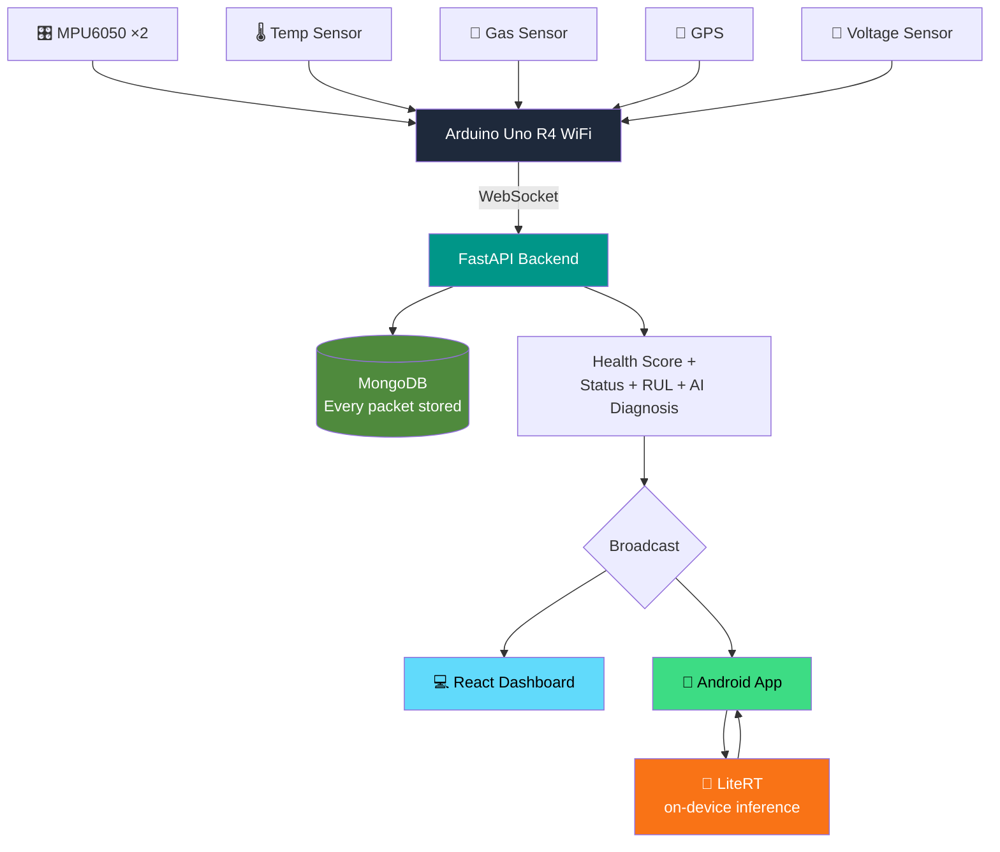

<div align="center">


### Built for the Qualcomm Snapdragon Hackathon 2026


<br>


<br>


</div>
<div align="center">

</div>

<div align="center">


[](https://drive.google.com/file/d/1ZgpC-3mUBnqxjNxovwh-o_ULIpidJMEM/view?usp=sharing)

</div>
<br>

> PulseDrive is an end-to-end AI-driven predictive maintenance platform that continuously monitors vehicle health using multiple IoT sensors, Edge AI, Agentic AI orchestration, and Qualcomm AI acceleration. Unlike traditional diagnostic systems that only detect faults **after** they occur, PulseDrive continuously analyzes real-time sensor telemetry to **predict failures before they happen**, estimate **Remaining Useful Life (RUL)**, generate **AI-powered recommendations**, and **automatically schedule maintenance** — all designed to run locally on Qualcomm Snapdragon AI hardware.

<div align="center">

</div>

<div align="center">

</div>



**Key rule:** sensors never talk to the database directly, and the phone never waits on the backend to know if a wheel is imbalanced — that decision happens locally, instantly, on-device.

<div align="center">

</div>

<div align="center">

</div>

| | Cloud-only | PulseDrive (Edge) |
|---|:---:|:---:|
| Latency | High | ⚡ Milliseconds |
| Works offline | ❌ | ✅ |
| Battery cost | Network-heavy | 🔋 NPU-efficient |
| Scales across vehicles | Backend bottleneck | Backend just stores + summarizes |

We evaluated Qualcomm's **Track 1 (LiteRT-LM / Gemma)** vs **Track 2 (LiteRT / TFLite / classical ML)** and chose **Track 2** — our problem is classification on IMU data, not a language task, so an LLM adds cost without adding accuracy. Snapdragon X Elite's dedicated **NPU** is what makes running two always-on models on a phone battery-realistic, and the same NPU access on a **Copilot+ PC** let us validate models locally during development — GenIE integration stays open as a future upgrade, not a requirement.

<div align="center">

</div>

<div align="center">

</div>

<div align="center">

**Team Name: PulseDrive**

| 👤 Member | ✉️ Email | 🛠️ Role |
|:---:|:---:|:---:|
| Tanish Aggarwal | tanishaggarwal.in@gmail.com | IoT & Machine Learning |
| Ishaan Maheshwari | ishaan.m16082006@gmail.com | IoT |
| Anshuman Dutta | anshuman.123dutta@gmail.com | Agentic AI |
| Yash Goel | yashgoel15119@gmail.com | Development |

</div>

<div align="center">

</div>

<div align="center">

</div>

```bash
git clone https://github.com/anshuman9468/PulseDrive-Snapdragon-Hack.git
cd PulseDrive-Snapdragon-Hack
```

### 🔧 Backend
```bash
cd backend
pip install -r requirements.txt
uvicorn app.main:app --host 0.0.0.0 --port 8000 --reload
```

### 💻 Frontend
```bash
cd frontend
npm install
npm run dev
```

### 📱 Android App (Kotlin + Jetpack Compose)

1. **Open the project** — launch Android Studio (Hedgehog or newer) → `Open` → select the `android/` folder from the repo.
2. **Let Gradle sync** — Android Studio auto-downloads dependencies on first open. Key ones already declared in `app/build.gradle.kts`:
```kotlin
   implementation("com.hivemq:hivemq-mqtt-client:1.3.3") // or OkHttp WebSocket, depending on active build
   implementation("org.tensorflow:tensorflow-lite:2.14.0")
   implementation("org.tensorflow:tensorflow-lite-support:0.4.4")
```
3. **Add the LiteRT models** — copy both files into `app/src/main/assets/`:
   - `vehicle_state_model_int8.tflite`
   - `wheel_imbalance_model_int8.tflite`
4. **Point the app at your backend** — open `NetworkConfig.kt` and set:
```kotlin
   const val SERVER_IP = "192.168.X.X"   // your laptop's local IP, NOT localhost
   const val WS_PORT = 8000
```
5. **Check permissions** in `AndroidManifest.xml` — `INTERNET` and `ACCESS_FINE_LOCATION` (for GPS display) should already be declared; grant location permission on first launch when prompted.
6. **Run it:**
   - Plug in a phone via USB with **Developer Options → USB Debugging** enabled, select it as the run target, and hit ▶️ Run in Android Studio, **or**
   - Use an emulator with Google Play Services (needed for location/maps features).
7. **Build a release APK** (for sharing/demo without a cable):
```bash
   ./gradlew assembleDebug
```
   The APK lands in `app/build/outputs/apk/debug/app-debug.apk` — install it directly on any Android device with `adb install app-debug.apk`.

> 💡 Same network gotcha applies here as the frontend: your phone and your backend machine must be on the **same Wi-Fi/hotspot**, and the backend's IP (not `localhost`) must be used in step 4.

<div align="center">

</div>

<div align="center">

</div>

| Component | Purpose |
|---|---|
| 🎛️ Arduino Uno R4 WiFi *(or UNO Q)* | Main controller |
| 📈 2× MPU6050 | Accel + gyro — front & rear axle |
| 🌡️ HS3003 | Temperature / humidity |
| 💨 MQ Gas Sensor | Smoke / gas ppm |
| 📍 GPS Module | Location telemetry |
| 🔌 BTS7960 | Motor driver |
| 🔋 Voltage Sensor | Battery health (via divider) |

**Why two IMUs?** A healthy vehicle gives similar vibration signatures front and rear. An imbalanced wheel shows up as a *difference* between the two — one IMU alone can't catch that.


<div align="center">

</div>

<div align="center">

</div>

**Backend:** `FastAPI` · `WebSockets` · `MongoDB` · `Pydantic` · `Groq` (diagnosis text) · `JWT`
Flow: packet arrives → validated → health score/status/RUL/diagnosis computed → stored in MongoDB → broadcast to all receivers (never back to sender).

**Frontend:** `React` · `TypeScript` · `Vite` · `Tailwind` · `Chart.js` — every UI element (gauges, GPS, diagnosis, charts, alerts) is driven live from the socket, nothing hardcoded.

<div align="center">

</div>

<div align="center">

</div>

| | Vehicle State Model | Wheel Imbalance Model |
|---|---|---|
| **File** | `vehicle_state_model_int8.tflite` | `wheel_imbalance_model_int8.tflite` |
| **Input** | `[1,6]` — Accel X,Y,Z · Gyro X,Y,Z | `[1,3]` — Gyro X,Y,Z |
| **Output** | Stationary / Moving / Inclined / Declined | Balanced / Imbalance |

Both run on-device via LiteRT. Test-rig confidence: ~0.996 for both — strong, but worth re-validating on real driving data.

<div align="center">

</div>

<div align="center">

</div>

| Status | Trigger | Theme |
|---|---|:---:|
| 🟢 Healthy | Normal temp/voltage/smoke, stable MPU | Green pulse |
| 🟡 Warning | Tyre imbalance (MPU1 ≠ MPU2 vibration) | Yellow glow |
| 🟠 Critical | Overheating (90–120°C) or motor overload | Orange pulse |
| 🔴 Emergency | Smoke 200–500ppm + high temp | Flashing red |

<div align="center">

</div>

<div align="center">

</div>


<div align="center">

</div>
